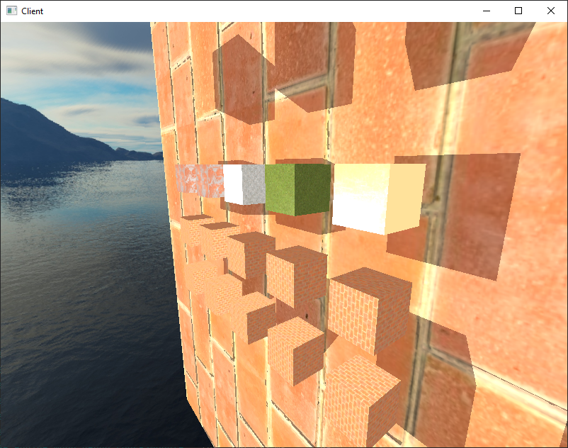
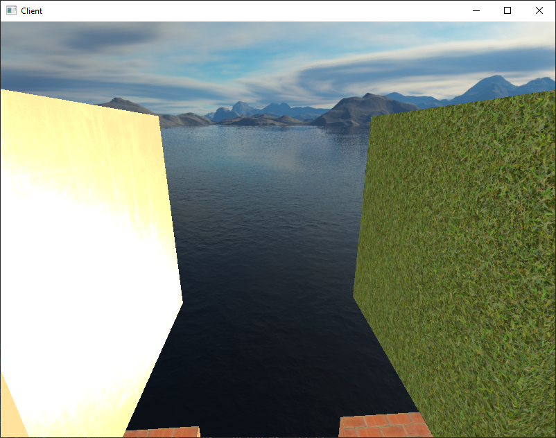

# MoonEngine

[![codecov][codecov-badge]][codecov]

[codecov]: https://codecov.io/gh/lat-green/MoonEngine
[codecov-badge]: https://codecov.io/gh/lat-green/MoonEngine/graph/badge.svg?token=UNBCVQQ7Q1&color=green

## Demos

### MoonDemo1

This demo demonstrates the operation of the following systems:
1. 3D graphics
   * PBR materials
   * skybox
   * light (directed/point)
   * shadow (directed/point)
2. 3D colliders

### MonkeyGame

This demo demonstrates the operation of the following systems:
1. 2D graphics
   * sprites
2. 2D colliders
3. 2D controllers
4. Multiple controllers

